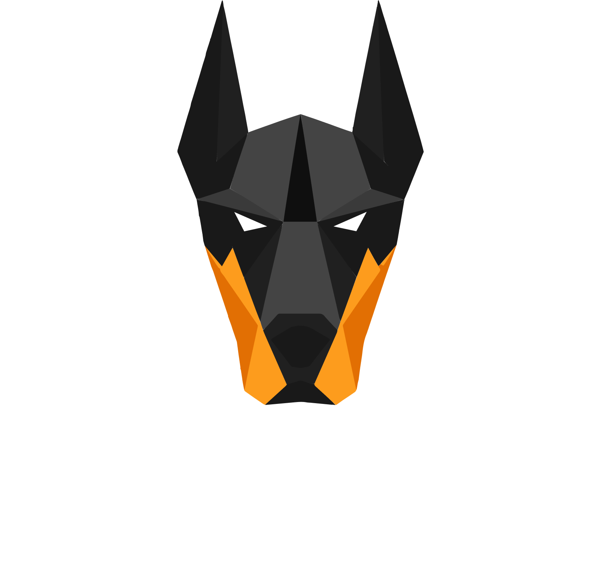

<p align="center">
  
</p>

<p align="center">
  <a href="https://github.com/albinalm/Vakthund/actions/workflows/qa.yml"></a>
  <!-- release-badge:start -->
  <a href="https://github.com/albinalm/Vakthund/pkgs/container/vakthund-ui?tag=2026.05.05.0002"></a>
  <!-- release-badge:end -->
  <a href="https://github.com/albinalm/Vakthund/pulse"></a>
  <a href="https://github.com/albinalm/Vakthund/blob/main/LICENSE"></a>
</p>

Vakthund is an HTTP inspection proxy. Drop it in front of any service, send traffic through it, and see exactly what is going on in a live Blazor UI.

It captures headers, bodies, tokens, timing, and auth failures without touching the target application. Useful for local development, but also runs well on servers and staging environments where you want a persistent inspection layer that survives restarts.

## What It Does

- Proxies HTTP traffic with YARP.
- Captures live request and response details.
- Streams captured requests from the proxy to the UI over SignalR.
- Decodes bearer JWTs and basic auth headers in the request detail view.
- Explains common auth failures with route-level issuer, audience, scope, role, and signature checks.
- Can decrypt JWE tokens when a key is configured.
- Shows dashboard metrics, request history, route configuration, and per-request details.

By default, captured traffic is kept in memory for the current run. Switch to disk storage to persist requests across restarts, set a retention window, and keep the dashboard graphs loaded between sessions.

## Documentation

- [Getting Started](docs/getting-started.md)
- [How Vakthund Works](docs/how-it-works.md)
- [Configuration](docs/configuration.md)
- [Using the UI](docs/using-the-ui.md)
- [Development](docs/development.md)

## Quick Start

The recommended setup is Docker Compose with two services:

- `proxy`, which accepts client traffic and forwards it to your target service.
- `ui`, which connects to the proxy management hub and displays captured requests.

For a single upstream service, set `TARGET` on the proxy:

```yaml
services:
  proxy:
    image: ghcr.io/albinalm/vakthund-proxy:latest
    ports:
      - "8080:8080"
      - "8081:8081"
    environment:
      TARGET: "http://host.docker.internal:5000"

  ui:
    image: ghcr.io/albinalm/vakthund-ui:latest
    ports:
      - "8082:8080"
    environment:
      HUB: "http://proxy:8081/connect/audit"
    depends_on:
      - proxy
```

Then send client traffic to `http://localhost:8080` and open the UI at `http://localhost:8082`.

You can also open `http://localhost:8081` in a browser to confirm the proxy management port is running.

For multiple upstreams or path-based routing, mount a routes file instead. See [Getting Started](docs/getting-started.md) for the full Compose example and the `routes.yaml` format.

## Projects

- `Vakthund.Proxy`: reverse proxy, request capture middleware, management endpoints, and SignalR audit hub.
- `Vakthund.UI`: Blazor Server frontend for dashboard, request list, request details, and configuration.
- `Vakthund.Shared`: shared models used by both services.
- `Vakthund.Tests`: unit tests plus the Docker/k6 smoke and load-test suite.

## License

Vakthund is completely FOSS and licensed under the terms in [LICENSE](LICENSE).
